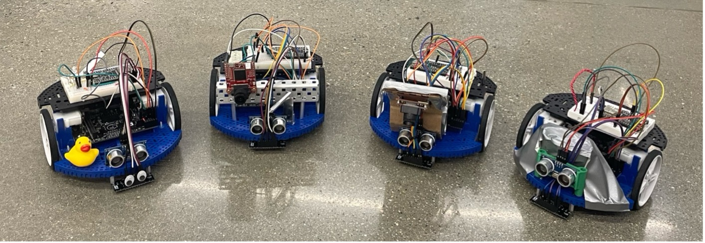
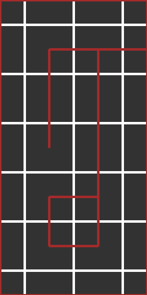
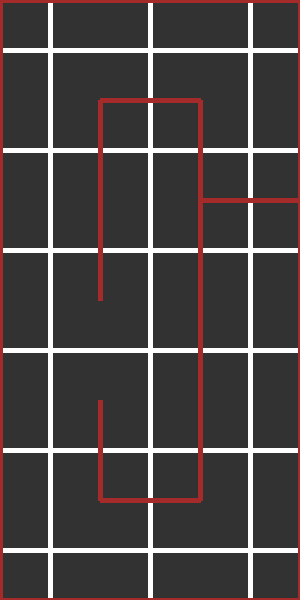

# RBE 2002 Maze Visualization

Team 4: Pau Alcolea, Ben Laster, Ben Proctor, Katy Stuparu

A-Maze-Me Repository: https://github.com/RBE-2002-D24/team-04-rbe-2002-a-maze-me

Library Repository: https://github.com/RBE-2002-D24/team-04-rbe-2002-lib


From left to right: Robot D (IR Emitter), Robot B (Button), Robot C (Ramp Climbing), Robot A (Ramp Balancing)

## How to run code
1. Set up the Python environment and install the packages `paho-mqtt` for communication with the Romi, and `pillow` for 
displaying the maze. (Note: I am using Python 3.9.6 with a virtual environment.)
```shell
$ python -m venv venv
$ . venv/bin/activate
(venv) $ pip install -r requirements.txt
```
2. Set up Robot D for mapping. The robot traces along the left side of the maze and reports its position to MQTT at 
each line intersection. Once it has mapped the entire maze, it communicates that to MQTT. The robot uses two ultrasonic 
rangefinders (one in the front of the Romi and one on the left of the Romi) for wall detection, a reflectance sensor 
for line following, and the IMU for ramp detection. The code for Robot D mapping is located here: 
https://github.com/RBE-2002-D24/team-04-rbe-2002-a-maze-me/tree/robot-d/mapping/robotD.
3. Before starting Robot D, start the Python script. The coordinates are recorded from the topic `team4/robot-d/(i, j)`. 
Once `team4/robot-d/complete:1` is received, the script stops recording coordinates from MQTT. The maze traversal path 
is used to create a graph of the maze, which is used to find the locations of the walls and draw the maze, shown below.
```shell
(venv) $ python maze-visualization.py
Connected to robomqtt.cs.wpi.edu
Received 'team4/robot-d/(i, j):(0, 0)'
Received 'team4/robot-d/(i, j):(0, 1)'
Received 'team4/robot-d/(i, j):(0, 2)'
Received 'team4/robot-d/(i, j):(0, 3)'
Received 'team4/robot-d/(i, j):(0, 4)'
Received 'team4/robot-d/(i, j):(0, 5)'
Received 'team4/robot-d/(i, j):(1, 5)'
Received 'team4/robot-d/(i, j):(2, 5)'
Received 'team4/robot-d/(i, j):(1, 5)'
Received 'team4/robot-d/(i, j):(0, 5)'
Received 'team4/robot-d/(i, j):(0, 4)'
Received 'team4/robot-d/(i, j):(0, 3)'
Received 'team4/robot-d/(i, j):(0, 2)'
Received 'team4/robot-d/(i, j):(1, 2)'
Received 'team4/robot-d/(i, j):(1, 3)'
Received 'team4/robot-d/(i, j):(1, 4)'
Received 'team4/robot-d/(i, j):(1, 3)'
Received 'team4/robot-d/(i, j):(1, 2)'
Received 'team4/robot-d/(i, j):(0, 2)'
Received 'team4/robot-d/(i, j):(0, 1)'
Received 'team4/robot-d/(i, j):(0, 0)'
Received 'team4/robot-d/(i, j):(1, 0)'
Received 'team4/robot-d/(i, j):(2, 0)'
Received 'team4/robot-d/(i, j):(2, 1)'
Received 'team4/robot-d/(i, j):(2, 2)'
Received 'team4/robot-d/(i, j):(2, 3)'
Received 'team4/robot-d/(i, j):(2, 4)'
Received 'team4/robot-d/(i, j):(2, 3)'
Received 'team4/robot-d/(i, j):(2, 2)'
Received 'team4/robot-d/(i, j):(2, 1)'
Received 'team4/robot-d/(i, j):(2, 0)'
Received 'team4/robot-d/(i, j):(1, 0)'
Received 'team4/robot-d/(i, j):(0, 0)'
Received 'team4/robot-d/complete:1'
Finished receiving coordinates

```


4. Another example:
```shell
(venv) $ python maze-visualization.py
Connected to robomqtt.cs.wpi.edu
Received 'team4/robot-d/(i, j):(0, 0)'
Received 'team4/robot-d/(i, j):(0, 1)'
Received 'team4/robot-d/(i, j):(0, 2)'
Received 'team4/robot-d/(i, j):(0, 3)'
Received 'team4/robot-d/(i, j):(0, 4)'
Received 'team4/robot-d/(i, j):(0, 5)'
Received 'team4/robot-d/(i, j):(1, 5)'
Received 'team4/robot-d/(i, j):(2, 5)'
Received 'team4/robot-d/(i, j):(2, 4)'
Received 'team4/robot-d/(i, j):(2, 5)'
Received 'team4/robot-d/(i, j):(1, 5)'
Received 'team4/robot-d/(i, j):(0, 5)'
Received 'team4/robot-d/(i, j):(0, 4)'
Received 'team4/robot-d/(i, j):(0, 3)'
Received 'team4/robot-d/(i, j):(0, 2)'
Received 'team4/robot-d/(i, j):(1, 2)'
Received 'team4/robot-d/(i, j):(1, 3)'
Received 'team4/robot-d/(i, j):(1, 4)'
Received 'team4/robot-d/(i, j):(1, 3)'
Received 'team4/robot-d/(i, j):(1, 2)'
Received 'team4/robot-d/(i, j):(1, 1)'
Received 'team4/robot-d/(i, j):(1, 2)'
Received 'team4/robot-d/(i, j):(0, 2)'
Received 'team4/robot-d/(i, j):(0, 1)'
Received 'team4/robot-d/(i, j):(0, 0)'
Received 'team4/robot-d/(i, j):(1, 0)'
Received 'team4/robot-d/(i, j):(2, 0)'
Received 'team4/robot-d/(i, j):(2, 1)'
Received 'team4/robot-d/(i, j):(2, 2)'
Received 'team4/robot-d/(i, j):(2, 3)'
Received 'team4/robot-d/(i, j):(2, 2)'
Received 'team4/robot-d/(i, j):(2, 1)'
Received 'team4/robot-d/(i, j):(2, 0)'
Received 'team4/robot-d/(i, j):(1, 0)'
Received 'team4/robot-d/(i, j):(0, 0)'
Received 'team4/robot-d/complete:1'
Finished receiving coordinates

```
